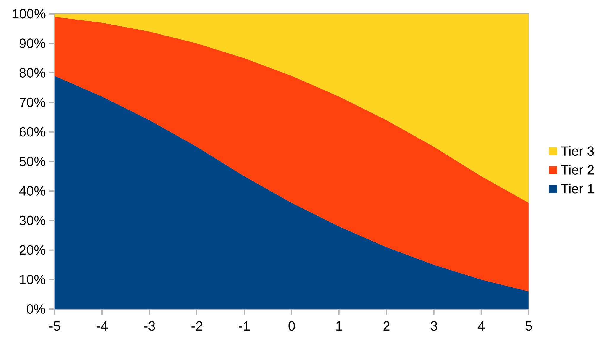
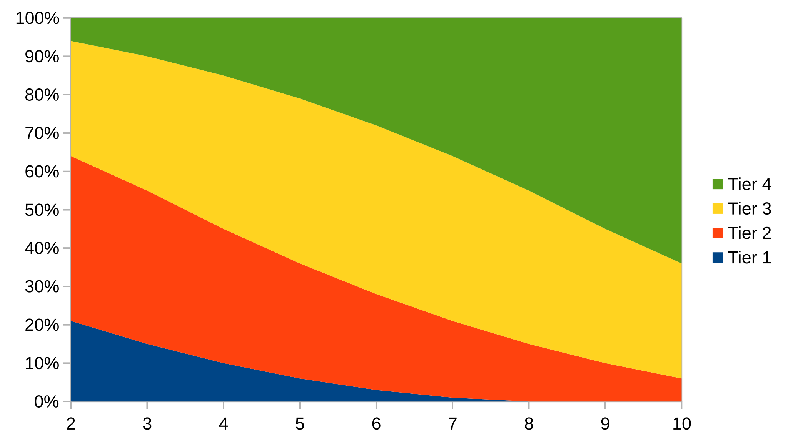

<!-- markdownlint-disable MD013 MD026 MD033 MD038-->
<!-- Long Lines; Punctuations at the end of title; Inline HTML, extra space in code-->

<script src="assets/theme-selector.js"></script>

---

The universe holds many mysteries waiting to be uncovered. Discard every assumption and pretense of knowing. You must be fearless and stay sharp at all times.

To play the game, you need polyhedral dice (d4, d6, d8, d10, d12, d20) and some way to track the Characters, be it pen and paper or digital. A Game Master and Players to form a Party. Snacks, optional but highly recommended.

---


## Character

### Attributes

Your character has three attribute scores; these are the measure of basic strengths and weaknesses.

- `STR`: Strength, Endurance, Resilience.
- `DEX`: Dexterity, Speed, Agility.
- `WIL`: Willpower, Charisma, Awareness.

Characters naturally fall between -2 and +3. But with magic they can be pushed to -5 and +5.

Choose a method, and stick to it:

- **Standard array**: Assign each Attribute one of these: `3 1 -1`.
- **Point buy**: Each Attribute starts with -2; Allocate 9 points however you like, but a single Attribute cannot be larger than 3.
- **Roll**: For each attribute in order `1d6 - 3`. You can swap two OR re-roll one attribute.

<details><summary>Example</summary>

```text
Rolled 4 -> 4-3 = 1 STR
Rolled 3 -> 3-3 = 0 DEX
Rolled 5 -> 5-3 = 2 WIL

Swapped DEX and WIL.

Recorded as:
STR 1 DEX 2 WIL 0
```

</details>

### Stats

#### Hit Protection

`HP` - this is the [damage your character can take](#taking-damage) without the risk of serious injuries.

Choose a method and stick to it:

- **Fix**: 4
- **Roll**: `2d6` and keep the highest.

<details><summary>Example</summary>

```text
Rolled (3 6) -> 6 HP

Recorded as: HP Current/Max

STR 1 DEX 2 WIL 0 HP 6/6
```

</details>

#### Coins

- This is the main currency, it can be used to [buy a starting gear](./items.md)
- Every 100 coins is 1 slot. Under 100 it is 0

Coins and gear are tied together at the start:

- GM can let the Players roll for items in a prepared starting gear list
- GM can prepare a list of items which is shared by the party
- GM can let the Players roll for coin and by [items](./items.md)
  - Default, GM can tweak the values, choose a method and stick to it:
    - **Fix Coins**: 75
    - **Roll**: `8d20`

<details><summary>Recommended</summary>

```text
| ----------------- | ---- | 75 |
| Large Backpack    | 30   | 45 | -> Store loot
| Rations  3x       |  3x2 | 39 | -> 3 day worth of food
| Torch 2x          |  5x2 | 29 | -> Light required, probably not enough for 3 days...
| Flint and Steel   |  3   | 26 | -> Hard to create fire without it
| One Handed Weapon | 10   | 16 | -> Offense
| Normal Shield     | 10   |  6 | -> Defense
```

</details>

#### Other Stats

<details><summary>Optionally</summary>

```text
Other stats can be recorded as well, depending on the game setting, such as:

- Speed: How much space/meters/feet the character can travel per Move action; Fly, Climb, and Swim speed can be tracked as well. (Default: 4)
- Size: The size of the character, used for calculations. (Default: Normal)
- Inspiration: A token of gratitude from the GM for good play, which can be exchanged for a re-roll. (Default: +1 for each player which brings snacks)
- Insanity: Level of ever-growing insanity in a horror setting.
- Etc
```

</details>

There are some stats that are provided by items; the table can decide if it is worth noting these down on the sheet, or if reading them from the items is sufficient.

- `Resistance`: [Resistance](#immunity-resistance-vulnerability) - this passively reduces the damage taken
- `Bonuses` and `Modifiers`

### Background

Name and describe your character in one or few words for each:

- **Appearance**: One unique trait they have.
- **Virtue**: One thing they excel at.
- **Vice**: One thing they fall short of.
- **Relationship**: With at least one party member.

These are used for role-play, and they could have mechanical impact on the game as well.

These can be rolled on random tables as well.

<details><summary>Example</summary>

```text
Flint
STR 1 DEX 2 WIL 0 HP 6/6

- Appearance: Long Blond hair, but left side is shaved.
- Virtue: Great Cheff.
- Vice: Hates boring food.
- Relationship: Childhood friends with Clayd.
```

</details>

Characters die easily. For quick character creation, players can roll on random tables for Background.

### Inventory


#### Two hands

- `2 slot` (hopefully)
- Characters can only use items if they are holding it.
- Hands can hold **stacked** items, but cannot use them until unstacked.
- With both hands a character can hold items which have more than **2 slot** within reason.
- Using a **Heavy** [Items](#offensive-items) (3 Slots) requires 3 `STR` or more.
- **Versatile** [Items](#offensive-items) (2 Slot) can be used as One or Two handed requiring 1 or 2 hand Slot respectively.

#### Belt and Pockets

- `4 slot`
- Items to quickly take/store/swap, it takes only a [Small Action](#combat) even when the time is constrained.

#### Backpack

- `10 slot`
- 3 things share **The Backpack** inventory:
  - Items in a backpack
  - Large items worn on the Body
  - Conditions affecting the character

##### Physical Backpack with Items

- It can hold items
- It can be removed/replaced/stolen etc.
- The largest size is 10. Smaller means cannot store items on larger slots.
- Storing items: Place the items anywhere they fit.
- Taking items, searching and rearranging:
  - When time is not constrained: Just do it.
  - When time constrained like in [Combat](#combat): To search for an item, roll `1d10`. You can grab any item which are located up to the rolled value. If an item covers more slots it can be grabbed even if it is only partially located. If you don't grab anything, you can rearrange the items in the backpack.

##### Body

- Large items worn on the Body need slots (Eg: Armor)
- Small items worn on the body does not need a slot. (Eg: Ring, Necklace, Earring, etc)
- Magic items does not like to share space on the body.
- Normal, non-armor clothing does not need slot if worn on the body.
- Mouth and other body orifices can be used to hold on items temporally.
- Access speed depends on the item and location, Eg: Removing a hat is quick, getting out of a plate armor takes a significant time.

##### Conditions

- Each Condition, be it boon or bane, takes up one inventory slot. It can affect more than just the inventory, and each has a condition for removal.
- Because of [Wounds](#wound) **The Backpack** acts as the secondary `HP`:
- If a Character's [Backpack](#backpack) is full and receives a condition, they must drop something if they can. If they cannot they [die](#death).
- Conditions which can be cleared **at will**, can be refused or cleared any time.
- [List of Basic Conditions](./conditions.md)

#### Items

Items have **Slot** and can have **Stackable** and **Usage** attribute.

- **x Slot**: This item takes x slot in the inventory.
- **stackable x**: This item can be stacked x times, until another **Slot** is required. Different Items can be stacked together if they are the same type.
- **x Usage**: Certain items have finite number of uses or duration tracked as [Usage](#usage).

##### Usage

After the item is used, roll an **usage dice** `xd6` but maximum `3d6`. For each die rolled 1 or 2 remove one **Usage**.

Usage can have further modifiers:

- **broken** or **ran-out** or **consumed**: The item become permanent broken if reaches **0 usage**, cannot be repaired, refuelled etc, or ran-out / consumed like ammunition, lamp oil, etc
- **time**: Roll **usage dice** when the time is up, or when the item usage is stopped.
- **conditions to restore**: Rest, Refuel, Repair, etc
  - If no condition given, it is usually means **Repair**.

Items without default usage can be worn-down/destroyed as well, so the GM can assign usage, or call **usage dice roll** for such items.

#### Offensive items

Each weapon has a **Damage dice** and rarely a **Bonus**. The bonus is a flat bonus damage each time a weapon deals damage.

Using **Heavy** weapon/armor requires 3 `STR` or more.

##### Melee

- [Melee weapons](./items.md#melee)
- When Dual Wielding, attacking with both weapons is considered one action, Roll [Usage](#usage) for both.
- Attacking multiple targets at once (swing): Roll once, share the damage.
- Unarmed or attack is `1d4`.
- Improvised weapon can give advantage + `1d4`.

##### Ranged

- [Ranged weapons](./items.md#ranged)
- Ammunition has [Usage](#usage), when making a ranged attack, roll usage for the ammunition.
- If the weapon is misused (eg: Melee-attacking/Blocking damage) roll the [Usage](#usage) for the weapon.
- Loading cost 1 [Small Action](#combat)
- Aiming and Shooting cost 1 [Action Point](#combat)
- Ranged weapons cannot be used melee range, they have short (default: 8 Space) and long range (default: 15 Space).

#### Defensive items

There are 2 types of defensive items: Passive (Armor) and Active (Shield).

##### Armor

- [Armor](./items.md#armor)
- Armor provides **Resistance:** The armor determines which damage types it can mitigate. Use common sense, be creative, nothing is impenetrable. Description of the attack can and should overwrite the default. The table should aim for consistency and the GM should rule case-by case fairy.

<details><summary>Examples</summary>

```text
Chainmail (Slashing, Piercing)
  Note: Can be piecred, for example with long poisoned needles
Plate-armor (Slashing, Bludgeoning, Piercing)
  Note: Metal weapons are greate at cunducting electricity...
  Note: Skilled dagger user might find the openings...
```

</details>

##### Shield

- [Shield](./items.md#shield)
- [Blocking](#active-defense) with a shield adds the **Block Bonus** to the [Attribute Roll](#attribute-roll).

### Character Progression

There is no class system; the items a character is holding define their options. A character can boost their potential by obtaining more versatile and powerful [Items](#items).

---


## Actions

The Players should describe or role-play what their Characters want to do or are doing. The GM should then describe the possible outcomes, or the outcome of their actions.

Many "Basic" actions are described in this book. They are not the only options, they are just the baseline. Players should think of clever ideas, both in and out of combat, and (try to) execute them; the GM should honor this.

Rolling dice should be risky. Players should avoid it and find clever solutions instead.

### Attribute Roll

Rolling to see if something happens is almost always on the side that is affected. In rare cases where an action is deemed fallible, the player has to roll a **Attribute Roll** to determine the outcome.

The GM should only ask for **Attribute Rolls** if the outcome is uncertain. As a rule of thumb, if the fail rate for the Character is below 25%, the action should automatically succeed.

The GM should ensure that the outcomes of a **Attribute Roll** are obvious to the Players before the roll.

Rolling an **Attribute Roll** is `2d10 + Attribute`

- Tier 1: `<10`: Failure (No)
- Tier 2: `10+`: Partial Success/Failure (Yes but, No but)
- Tier 3: `15+`: Success (Yes)
- Critical Failure: Natural 2 or 3 (No and)
- Critical Success: Natural 19 or 20 (Yes and)

<details><summary>For Nerds</summary>

|  %  | Tier 1 |  Tier 2 | Tier 3 |
| --- | ---    |  ---    | ---    |
| -5  | 79     | 20      |  1     |
| -4  | 72     | 25      |  3     |
| -3  | 64     | 30      |  6     |
| -2  | 55     | 35      | 10     |
| -1  | 45     | 40      | 15     |
| +0  | 36     | 43      | 21     |
| +1  | 28     | 44      | 28     |
| +2  | 21     | 43      | 36     |
| +3  | 15     | 40      | 45     |
| +4  | 10     | 35      | 55     |
| +5  |  6     | 30      | 64     |

Critical Failure: 3%
Critical Success: 3%



</details>

### Damage roll

Roll an **Attribute Roll** with the Attribute used for the attack.

- Tier 1: +0 dmg
- Tier 2: +1 dmg
- Tier 3: +2 dmg
- Critical Failure: Attacker receives the full damage, or something similarly terrible
- Critical Success: Double Damage or Injury

Each [Weapon](#offensive-items) that can be used to deal damage has a **Damage dice** to roll damage with. Roll the dice: that is the damage.

Roll [Usage Dice](#items) as well. The **usage** does not influence the result.

All can be rolled at once if the player has enough distinguishable dice.

### Advantages and Disadvantages

Stacking flat plus or minus modifiers

### Magic roll

See [Spell Casting](#spell-casting)

## Information

Information is freely given, never tied to rolling dice. The GM should describe everything clearly; the Players should ask frequently, and the GM should answer honestly. It is better to give the Players more choices than to dwell on whether their characters should know something or not.

The GM should always telegraph dangers. Players need ample warning so they can decide whether to heed it or ignore it and rush to their demise. Injury, death, and all negative outcomes should be the consequence of the Players' choices; they should never come as a surprise.

Dangers should be meaningful; the GM should never shy away from punishing recklessness.

On the other side, the GM should always reward cleverness. If the Players find a way to bypass difficult traps or defeat hard bosses with ease, let them have it.

## Taking Damage

Characters take damage to their [Hit Protection](#stats) `HP` until it is depleted, unless stated otherwise (wound/injuries). All excess damage, and all damage after `HP` is depleted, add +1 [Wound](#wound).

`0 HP`: The character has no more endurance/will/luck to avoid wounds.

### Wound

The **Wound** is a [Condition](#conditions) which can be cleared by [Resting](#resting).

Taking too many wound can result in [Death](#death).

### Injuries

- In extreme cases, a character can suffer injuries like dismemberment.
- This usually permanent, gory and requires immediate attention. Take +1 [Wound](#wound) every minute.
- Modify the Character Sheet. (Eg: Lost leg: slower movement speed; Lost arm: remove arm inventory slot, etc)
- Critical Success on an [Damage Roll](#damage-roll) could be the source of injuries.

### Death

A character will die if their [Backpack](#backpack) is full, cannot drop anything and receive another [Condition](#conditions).

### Defense

#### Passive Defense

Provided by items such as [Armor](#armor) or [Conditions](#conditions).

#### Active Defense

- **Block with Shield**: A `STR` [Attribute Roll](#attribute-roll) with [Block Bonus](#shield).
  - Cost: Roll [Usage Dice](#usage) for the shield
  - Tier 1: Full damage + 2
  - Tier 2: Half damage (rounded down)
  - Tier 3: 0 damage
  - Critical Failure: Double damage
  - Critical Success: Push the enemy so hard they become [Prone](./conditions.md#prone)
- **Dodge**: A `DEX` [Attribute Roll](#attribute-roll).
  - Cost: 1 [AP](#action-point)
  - Tier 1: Full damage
  - Tier 2: Half damage (rounded down) + can move 1 space
  - Tier 3: 0 damage + can move 1 space
  - Critical Failure: Double damage
  - Critical Success: 0 damage + Can move **Speed** space
- **Parry**: A [Damage roll](#damage-roll) with a weapon plus [Parry Bonus](#shield).
  - If higher: Subtract the attacker's damage and apply the remainder to the attacker
  - If lower: Full damage + 2
- **Reckless Counter Attack**: A [Damage roll](#damage-roll) with a weapon.
  - Apply damage to both. Ignore both Character's [Resistance](#immunity-resistance-vulnerability) including [Armor](#armor)
- **Counter Spell**: Burn two [Tarot Cards](#magic) the lowest must be higher than the card used for casting the spell.
  - Countering a spell is only possible before the spell resolved (The `2d10` rolling did not happened yet)
  - Cannot counter spells with Automatic Success.
  - It is possible to close by characters provide 1-1 **Tarot Card** to counter a spell.

Players can come up with any other defensive action; the GM should consider them and honor creativity and role-play.

### Immunity, Resistance, Vulnerability

Some Items provide and some creatures can have Immunity, Resistance, Vulnerability to different types of damage.

- **Immunity**: Total immunity to a certain damage type. Extremely rare.
- **Resistance**: Resistance to a certain damage type. If a character receives damage which can be resisted by worn/used item:
  - If the **usage** is higher than the **damage**: subtract the **damage** from the **usage**. Roll this many [Usage Dice](#usage).
  - If the **damage** is higher than the **usage**: subtract the **usage** from the **damage**. Roll **usage** [Usage Dice](#usage) and receive the rest as damage.
  - The character receives damage for each **usage** removed.
- **x Vulnerability**: Vulnerability to certain damage type. +x Extra damage is received from this damage type.

### Other source of damage

- Falling: 3 meter or more: 1d6 blunt damage for every 3 meters
- Suffocation: Can hold breath for `STR` minutes (minimum 1) after that take 1d10 wounds every minute

---


## Magic

Spells are living spirits, travelers between worlds. To stay, they possess physical objects.
To cast a spell, your character must have the possessed item in their hand, and say aloud an incantation to ask the spirit for its power and/or fulfill other prerequisites.

- At Rest draw `(WIL or 0) + number of spells you have` cards from the shared tarot deck (78 cards), this is your 'Mana pool'.
- When the party rests, all remaining cards are returned to the deck and it is reshuffled.
- If the deck runs out of cards, the burned ones can be reshuffled.

### Spells

- [Cairn Spells](./cairn_spells.md)
- **DnD Spells**: Characters can cast up to their **WIS** Level any spell (if they have the spell/spirit/artifact). Cantrip = Level 0
- **Adventure spells**: Magic is Magical (duh!), nothing can prevent it to brake rules or create never-seen-before spells with unique mechanics.

**Defaults if not stated/implied otherwise**:

- Range: 8 Space
- Time: 10 minutes
- Spell component: Verbal
- Usage: 2 recharge on [Rest](#resting)

### Spell Casting

- Hold a single spirit possessed object in hand, without touching any other.
- Fulfill the **Spell Components**.
- Choose a card then burn it. This is the modifier.
  - 2-10: numeric value
  - Jack, Knight, Queen, King: 10
  - Ace: Auto Success (no need to roll)
  - [Major Arcana](./major_arcana.md): Auto Success (no need to roll) + The special effect
- Roll `2d10`
- Result of `2d10 + card modifier`:
  - Tier 1: `<10`: Failure
  - Tier 2: `10+`: Choose:
    - Failure and draw a new card
    - Success and gain a [Drained Condition](./conditions.md#drained).
  - Tier 3: `15+`: Success
  - Tier 4: `20+`: Success and draw a new card
  - Critical Failure: Failure and gain a [Drained Condition](./conditions.md#drained).
  - Critical Success: Success, draw a new card and keep the card used for casting the spell
- Roll [Usage](#usage) for the spirit possessed object. (can be rolled alongside with the 2d10)

The GM can draw from the deck each time an NPC casts a spell instead of drawing all at once and choosing from the hand.

<details><summary>For Nerds</summary>

|  %  | Tier 1 |  Tier 2 | Tier 3 | Tier 4 |
| --- | ---    |  ---    | ---    | ---    |
|  2  | 21     | 43      | 30     |  6     |
|  3  | 15     | 40      | 35     | 10     |
|  4  | 10     | 35      | 40     | 15     |
|  5  | 6      | 30      | 43     | 21     |
|  6  | 3      | 25      | 44     | 28     |
|  7  | 1      | 20      | 43     | 36     |
|  8  | 0      | 15      | 40     | 45     |
|  9  | 0      | 10      | 35     | 55     |
| 10  | 0      |  6      | 30     | 64     |

Critical Failure: 3%
Critical Success: 3%



</details>

---


## Time

- Day (24 hours; 4 watches)
  - Segments: Morning, Afternoon, Evening, Night
  - Marks: Sunrise, Noon, Sunset, Midnight
  - Usage: Long travel
- Watch (6 hours; 36 Turns)
  - Segments: 6 segments (1 hour each)
  - Marks: Every 3rd Turn (30 min)
  - Usage: Medium travel, [Rest](#resting) (6 hours)
- Turn (10 minutes; 10 Rounds)
  - Usage:
    - All combat takes at least one Turn.
    - A Party can explore a normal sized room in one Turn, larger room or through inspection takes more turns.
- Round (~1 minute; 3 Actions)
  - Usage: Combat
  - Each combatant takes 3 Actions, that is one Round.
- Action (~10 sec)
  - Usage: Combat

You can use [Mausritter](https://mausritter.com/)'s Turn Tracker to track time.

Time is the main currency, events occurs with or without the players in the world.

### Resting

Everyone needs rest, brave adventurers are not exempt from this rule.

**Requires:**

- Safe space
- Food
- Minimum 6 hours total with 4 hours uninterrupted sleep

**Provides by default at the end:**

- Restore all [HP](#stats)
- Restore [Usage](#usage) for items which are **Rest** restored.
- Drop all [Tarot Cards](#magic) and draw `(WIL or 0) + number of spells you have`
- Clear [Conditions](#conditions) which are tied to **Rest**. (Like [Wounds](#wound))

**Extra light activities, can be done while keeping watch:**

- Repair items (if possible in the situation) -> Restore [Usage](#usage)
- Tend another Character's [Wound](#wound) -> Remove +1 wound or +2 if first aid kit or other kind of applicable healing is used.
- Cooking over fire: +1 [Wound](#wound) removal or [Well-Fed Condition](./conditions.md#well-fed)
- Craft items (if possible in the situation)
- Experimenting with or studying an unknown magic artifact
- Prepare mentally or physically for a described specific task you want to achieve right after the rest -> Possible Advantage(s) for that task.
- Other light activities described or faded in the black.

**Encounters during Rest:**

If the Party tries to Rest in an unsafe place, there is a possibility for an encounter. They should prepare for it, keep watch in rotation, plant traps or a warning system, or not and get a surprise.

Interrupted Rest does not give any benefits. But it is possible to continue an interrupted Rest.

### Hunger

If a characters does not eat for a day (24 hours), they gain a [Hungry Condition](./conditions.md#hungry)

---


## Light

Without proper light source characters cannot navigate or act, unlike some creatures. There are 3 levels of light:

- Bright (Sun, torch, lantern) - no modifiers
- Dim (candle, match) - Disadvantage 2
- Darkness (nothing) - Disadvantage 5

## Combat

Combat can be run anywhere on the spectrum from "Theatre of the Mind" to full tactical with battle maps. The table can agree on a mode beforehand, or try different modes, or categorize fights by type. A random encounter does not have to be tactical, whereas a long BBEG fight is better with a battle map.

### Action Point

**Action Point** `AP` is the resource that defines how many **Actions** a Character can take in one [Round](#time).

### Small Action

There is one free **Small Action** per [Round](#time): opening/closing a door, pushing a button, picking up one item from the floor, loading ammunition, Accessing (take/store/swap) [Belt and Pocket](#belt-and-pockets), etc, Each further **Small Action** requires 1 `AP`.

### Free Action

Dropping [items](#items) from hands, and dropping **at will** [Conditions](#conditions) from [Backpack](#backpack) is a **Free Action**.

### Initiative

Combat starts when someone attacks. The attacker starts with 2 `AP` (after their attack is resolved). There is no initiative order; instead, roll a `DEX` or `WIL` [Attribute Roll](#attribute-roll) for each combatant to determine starting `AP` for the 1st round:

- Surprised: Roll a `WIL` [Attribute Roll](#attribute-roll)
  - Tier 1: 0 AP
  - Tier 2: 1 AP
  - Tier 3: 2 AP
  - Critical Failure: 0 AP + [Prone Condition](./conditions.md#prone)
  - Critical Success: 3 AP
- Not Surprised: Roll a `DEX` [Attribute Roll](#attribute-roll)
  - Tier 1: 1 AP
  - Tier 2: 2 AP
  - Tier 3: 3 AP
  - Critical Failure: 0 AP + [Prone Condition](#conditions)
  - Critical Success: 3 AP + [Refreshed](./conditions.md#refreshed) or [Focused](./conditions.md#focused) Condition.

### Rounds

Split the Combatants into opposing parties (usually two, but three-way or more battles are possible as well).

The 1st Attacker's Party goes first, then the 1st Victim's Party second (and if there are more parties, the order of the rest is decided by the GM).

From each party, do one action or combined/combo actions, then continue with the next party.

There is no strict order within a party; if Players cannot decide, go clockwise from the Player who last acted.

<details><summary>Example for the overall flow</summary>

```text
Players stumble upon a random Goblin party.
They don't know it yet, but the Goblins are the bait for a Witch who wants to eliminate the party.

-- Initiative --

Player party (P) | Goblin Party (G) | Witch Party (W)
        Flint 2  |        Leader 1  |        Witch 2
        Clayd 1  |       Warrior 0  |
         Bore 1  |        Archer 0  |

-- Round 1 --

(P) Flint, without thinking, rushes in and attacks the Goblin Leader with his rapier {starting the battle} (1 AP Attack) [Flint 1 AP]
(G) The Goblin Leader attacks Flint (1 AP Attack) [Goblin Leader 0 AP]
(W) Witch opts out to not reveal herself [Witch 2 AP]

(P) Clayd asks Bore for buffs; Bore buffs Clayd (1 AP Spell Casting) [Bore 0 AP]
(G) Goblins are out of AP
(W) Witch opts out to not reveal herself again [Witch 2 AP]

(P) Clayd moves next to Flint and the Goblin Leader (1 AP Move) [Clayd 0 AP]
(G) Goblins are out of AP
(W) Witch casts Entangling Roots over the Goblins and Players (1 AP Spell) [Witch 1 AP]

(P) Flint attacks the Goblin Leader with his rapier (1 AP Attack) [Flint 0 AP]
(G) Goblins are out of AP
(W) Witch casts Raining Fire over the Goblins and Players (1 AP Spell) [Witch 0 AP]
    Killing the Goblin Leader and doing significant damage to everyone, also burning up the vines.

-- Round 2 --
(All Combatants' AP is reset to 3)

(P) Clayd realizes the dire situation and runs for an escape (3 AP Move) [Clayd 0 AP]
(G) Goblin Warrior flees in the opposite direction [Goblin Warrior 0 AP]
(W) Seeing the fleeing Player, the Witch starts to cast something big (3 out of 6 AP Spell Casting) [Witch 0 AP]

(P) Bore sees the Witch casting a longer spell and comes up with the idea to teleport Flint above the Witch for a divebomb attack.
    He shouts the idea to Flint and casts the Teleport Ally Spell (1 AP Spell Casting).
    Flint realizes the situation just in time and divebombs the Witch with his rapier (1 AP Attack) [Bore 2 AP, Flint 2 AP]
(G) Goblin Archer flees with the Warrior [Goblin Archer 3 AP]
(W) Witch realizes she would die before the ritual is finished and stops it, which creates a magical explosion...

```

</details>

Anything a Character can do, they can do in combat as well. Players should propose ideas; the GM can decide if they are viable or risky (and may request a [Attribute Roll](#attribute-roll)) and set the `AP` cost (which can be more than one).

<details><summary>Example Basic Actions</summary>

```text
- Attack with a weapon
- Aim and Shoot
- Move
- Cast a spell
- Help
- Tackle/Grab/Grapple
- Toss/Push/Shove
- Use Contraption
```

</details>

Characters can combine multiple Actions in one go. For example, running and shoving an enemy with greater impact for 2 `AP`.

Characters can also perform combos for greater impact. For example, one character distracts the enemy while another stabs them in the back.

Players should describe or role-play their action in enough detail to leave no doubt; the GM should confirm the details, and after all agree, [roll for the Action](#actions) (or simply do it; not all Actions require rolls).

<details><summary>Example</summary>

```text
- Player: Can I shoot the goblin at the entrance with my slingshot?
- GM: Yes, the goblin is at "Short" range, so use the "Short" range Damage die. Do you have ammunition loaded in the slingshot? There is rubble next to you if you want to grab a stone.
- Player: Okay then, I grab a sharp stone from the rubble next to me, load it into the slingshot, then aim at the goblin by the entrance and shoot.
- GM: That would be one Small Action to grab the stone, 1 AP to load the slingshot, and 1 AP to Aim and Shoot. If you go with this, you can roll your Damage die.

```

</details>

A Character repeating the same Action is penalized with +1 disadvantage, so switch weapons, cast other spells, etc.

If a Combatant is attacked and aware of the attack, they can defend themselves. They can use the [Defence actions](#active-defense), or come up with an idea based on the situation and their abilities.

<details><summary>Example</summary>

```text
- GM: Flint, this goblin tries to attack you with a dagger (d4). Do you want to defend yourself?
- Player: Yes, I would like to Parry with my Rapier, which has a +1 Parry advantage.
- GM: Okay then, do a Damage roll with Usage Dice, and we will see the outcome.

```

</details>

After each Combatant has exhausted all their `AP` (or opted out of using some), start the next round and reset all combatants' `AP` to **3**.

### End of Combat

Combat ends when there is no willing and capable opposition remaining. This can be a combination of a peace treaty, surrender, fleeing, incapacitation, or death. Most creatures want to live and preserve their health, especially when there is nothing important worth fighting for.

## Compatibility

- OSR monster HD is rolled with d8.

## Resources and Shoutout

Special thanks to:

- [Cairn](https://cairnrpg.com/) for the Spells
- [Mausritter](https://mausritter.com/) for the inspiration of the Inventory, Item, and Usage marks system
- [Maze Rats](https://questingblog.com/maze-rats/) for inspiration
- Countless other RPGs and Adventures for inspiration

Resources:

- Fonts:
  - [Bagnard](https://open-foundry.com/fonts/bagnard) - [SIL Open Font License](./assets/Bagnard-License-OFL.txt)
  - [Young Serif](https://open-foundry.com/fonts/young-serif) - [SIL Open Font License](./assets/YoungSerif-License-OFL.txt)
  - [Office Code Pro](https://open-foundry.com/fonts/office-code-pro) - [SIL Open Font License](./assets/officecodepro-License-OFL.txt)
- Theme:
  - [Rose Pine](https://rosepinetheme.com/) - [MIT License](https://github.com/rose-pine/rose-pine-theme/blob/main/LICENSE)
- Artwork:
  - [Gordy Higgins](https://www.gordyh.net/) - [Public Domain](https://en.wikipedia.org/wiki/Public_domain)


